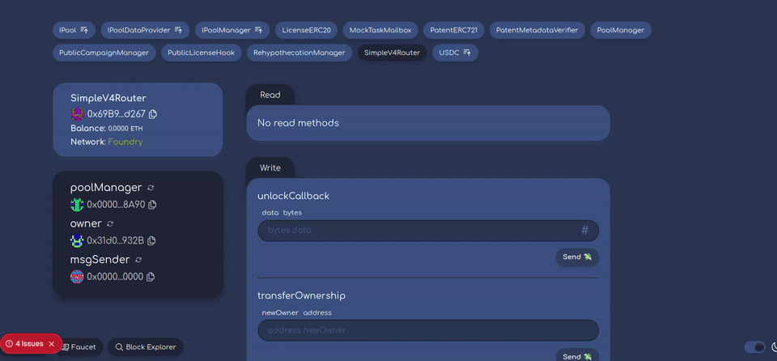

# Liquid IP Protocol

<h4 align="center">
  <a href="#overview">Overview</a> |
  <a href="#architecture">Architecture</a> |
  <a href="#monorepo-structure">Monorepo Structure</a> |
  <a href="#getting-started">Getting Started</a> |
  <a href="#running-against-a-forked-mainnet">Forked Mainnet</a> |
  <a href="#frontend-test-swaps-with-simplev4router">Frontend</a> |
  <a href="#rehypothecation-manager">Rehypothecation</a> |
  <a href="#performer-service-go">Performer</a> |
  <a href="#sponsor-integration">Sponsor Integration</a> |
  <a href="#testing-\u0026-development">Testing</a>
</h4>

🔬 A decentralized protocol that transforms intellectual property licenses into liquid assets, solving the complex, expensive, and opaque patent licensing system through smart contracts and decentralized infrastructure.

⚙️ Built using Uniswap v4 Hooks, Fhenix FHE, EigenLayer AVS, Aave v3, and Foundry.

**The Problem**: According to WIPO, EPO, and USPTO databases, there are over 150,000 active refrigerator-related patents worldwide, with a typical fridge involving 150-300 patents. The current patent system is overly complex, expensive, and dominated by opaque lump-sum deals and defensive litigation.

**Our Solution**: A smarter system that leverages decentralized infrastructure and smart contracts to enable real-time, usage-based licensing that is fair, scalable, and cost-effective.

- 🔐 **"Vending Machine" License Distribution**: One-way purchase mechanism via Uniswap v4 hooks (no resale to avoid regulatory issues)
- 🛡️ **Decentralized Patent Verification**: EigenLayer AVS validates patent metadata authenticity
- 💰 **Automatic Yield Generation**: Rehypothecation of idle campaign funds to Aave v3
- 🌊 **Epoch-Based Liquidity Management**: Granular license allocation across time periods
- 🎯 **Dual Campaign Types**: Public campaigns for transparency, private campaigns with FHE encryption


## Overview

Liquid IP transforms patent licenses into tradeable ERC20 tokens, creating liquid markets for intellectual property. Patent holders can sell licenses at scale while maintaining ownership, and buyers can trade licenses freely in secondary markets.

## Architecture

### Core Components

#### 1. License Tokens
- **LicenseERC20**: ERC20 tokens representing licenses for specific patents
- **PatentERC721**: NFT representing patent ownership
- Each patent can have multiple license campaigns with different terms

#### 2. Campaign Types

**Public Campaigns (`PublicLicenseHook`)**
- Transparent campaign parameters
- Open epoch schedules and liquidity ranges
- Suitable for public IP licensing

**Private Campaigns (`PrivateLicenseHook`)**
- Encrypted campaign parameters using **Fhenix FHE**
- Hidden liquidity ranges and allocation strategies
- Suitable for sensitive business IP

#### 3. Rehypothecation System
- **RehypothecationManager**: Routes idle campaign proceeds into Aave v3 to earn yield
- Per-pool, per-currency vaults keyed by Uniswap v4 `PoolId` and `Currency`
- Returns principal plus accrued yield to campaign owner after campaign ends
- Supports both ERC20 tokens and native ETH via Aave's Wrapped Token Gateway

#### 4. Patent Verification via EigenLayer AVS
- **PatentMetadataVerifier**: Coordinates off-chain verification via EigenLayer TaskMailbox
- At epoch start, verification tasks are dispatched to designated performer services
- Decentralized verification network with economic security from staked ETH
- Prevents circulation of invalid patent licenses through cryptographic proofs

## Sponsor Integration

### Fhenix Integration

Liquid IP leverages **Fhenix's Fully Homomorphic Encryption (FHE)** for private campaign functionality targeting institutional users who require confidentiality.

**Key Benefits:**
- **On-chain Privacy**: Campaign tick ranges and liquidity amounts remain encrypted using Fhenix's `InEuint32` and `InEuint128` types
- **Institutional Protection**: Prevents competitors from seeing sensitive licensing strategies and position ranges
- **Asynchronous Execution**: Swaps are deferred until FHE decryption completes to avoid revealing parameters prematurely
- **COFHE Integration**: Uses Fhenix's COFHE library for robust FHE operations

**Implementation:**
- `PrivateLicenseHook` stores encrypted position parameters using Fhenix FHE types
- Campaign configuration uses encrypted inputs that remain hidden until epoch activation
- Decryption is triggered asynchronously when epochs become active
- Swaps are stored as pending until decryption results become available for position creation

### EigenLayer Integration

Liquid IP uses **EigenLayer's AVS (Actively Validated Services)** for decentralized patent verification to prevent circulation of invalid patent licenses.

**Key Benefits:**
- **Decentralized Trust**: No single point of failure for patent validation through distributed operator network
- **Economic Security**: EigenLayer operators stake ETH to secure the verification network
- **TaskMailbox Coordination**: Leverages EigenLayer's proven task coordination and result submission system
- **Off-chain Processing**: Go-based performer services handle metadata retrieval and validation logic

**Implementation:**
- `PatentMetadataVerifier` implements EigenLayer's TaskMailbox system for patent verification workflows
- Patent validation is triggered automatically during swaps to ensure license authenticity
- Verification tasks are dispatched to operator sets with encoded patent metadata URIs
- Off-chain performer services validate patent metadata and submit results back on-chain
- Patent status is tracked with states: UNKNOWN, VALID, INVALID, or UNDER_ATTACK

## Technical Specifications

### Dependencies
- **Uniswap v4**: Core AMM infrastructure and hooks
- **Fhenix FHE**: Homomorphic encryption for private campaigns
- **EigenLayer**: Decentralized patent verification network
- **Aave v3**: Yield generation through lending markets
- **OpenZeppelin**: Standard contract libraries

### Smart Contracts

| Contract | Description |
|----------|-------------|
| `PublicLicenseHook` | Transparent IP license campaigns |
| `PrivateLicenseHook` | Encrypted IP license campaigns (Fhenix) |
| `RehypothecationManager` | Automatic yield generation via Aave |
| `PatentMetadataVerifier` | EigenLayer AVS integration |
| `LicenseERC20` | Tradeable license tokens |
| `PatentERC721` | Patent ownership NFTs |

## Monorepo Structure

- `packages/foundry`: Solidity contracts, tests, and deployment scripts
- `packages/nextjs`: Next.js app (Scaffold-ETH 2)
- `packages/performer`: Go performer service for off-chain processing

## Getting Started

### Prerequisites
- Node.js >= 20.18
- Yarn workspace
- Foundry (`forge`, `cast`)
- Anvil (ships with Foundry)
- A mainnet RPC URL for forking (Alchemy/Infura/etc.)

### Clone
```bash
git clone <repository-url>
cd liquid-ip
```

### Install
```bash
yarn install
git submodule update --init --recursive
```

### Build and Test (quick start)
```bash
yarn compile
yarn test
```

## Running Against a Forked Mainnet

1) Start a mainnet fork on port 8545
```bash
# Config contains valid mainnet RPC endpoint
yarn fork
```

2) Deploy contracts to the fork
```bash
# Uses packages/foundry/script/Deploy.s.sol
yarn deploy
```

Notes
- The deploy script mints USDC to the deployer on the fork via FFI using `cast` and configures a Uniswap v4 pool with the `PublicLicenseHook`.
- A minimal Task Mailbox mock is used locally so verifier tasks complete instantly with VALID status.
- Deployment addresses and ABIs are written to `packages/nextjs/contracts/deployedContracts.ts`.
- If the fork was just started, allow 3-5 minutes for data to warm before running scripts.

## Frontend: Test Swaps with SimpleV4Router

1) Ensure the fork (31337) is running and contracts are deployed (`yarn deploy`).

2) Start the frontend
```bash
yarn start
```

3) Connect your wallet to `localhost:31337` and open the debug UI
```
http://localhost:3000/debug
```

4) Authenticate as the deployer in the UI (local dev only)
- Import this deployer private key into your wallet (e.g. MetaMask) while connected to the `localhost:31337` network:
```
0x879c8f8b406951ff3d1384017fe6080db719649d946597ef10c038734772c95b
```

5) Stake the Patent NFT into the Campaign Manager
- In the debug page, open `PatentERC721` and call:
  - `safeTransferFrom(<you>, <campaignManager>, 1)`
- This stakes tokenId `1` and enables the campaign pool logic.

6) Approve USDC for the `SimpleV4Router`
- In the debug page, select the USDC contract (from deployed contracts) and call `approve(router, amount)` from the deployer account.

7) Call `SimpleV4Router.swapExactInDefault(amountIn, amountOutMinimum)`
- The router is pre-configured in the deploy script with the default `PoolKey` for the campaign’s pool.
- Set `amountIn` in USDC base units (6 decimals) and a conservative `amountOutMinimum`.



## Rehypothecation Manager

The `RehypothecationManager` routes idle campaign proceeds into Aave v3 to earn yield during the campaign and returns principal plus accrued yield to the campaign owner after the campaign ends.

What it manages
- Per-pool, per-currency vaults keyed by Uniswap v4 `PoolId` and `Currency`
- aToken balances attributed to each active campaign
- Authorized hooks that are allowed to initialize and deposit on behalf of campaigns

Key functions
- `authorizeHook(address)` / `revokeHook(address)`: Owner-managed allowlist of hook contracts
- `initializeCampaign(PoolId, Currency, campaignOwner, campaignDuration)`: Creates an active vault; verifies Aave support
- `deposit(PoolId, Currency, amount)`: Supplies ERC20 or ETH proceeds to Aave; allocates aTokens to the campaign
- `withdrawCampaignFunds(PoolId, Currency)`: After end time, sends principal + yield to `campaignOwner` and closes the vault
- `getAccruedYield(PoolId, Currency)`: View function to estimate yield accumulated so far

Aave integration
- Resolves aToken via `IPoolDataProvider.getReserveTokensAddresses`
- Supplies ERC20 via `IPool.supply`
- For native ETH currency, uses Aave’s Wrapped Token Gateway for deposit/withdraw

Security/permissions
- Only authorized hooks can initialize and deposit (`onlyAuthorizedHook`)
- Only the designated `campaignOwner` can withdraw after the campaign ends

Configured endpoints (mainnet fork)
- Aave Pool, PoolDataProvider, and Wrapped Token Gateway are wired in the deploy script and can be adjusted in `packages/foundry/script/Deploy.s.sol`

How to observe in the UI
- Use the debug page to read vault state: call `getCampaignVault(poolId, currency)` and `getAccruedYield(poolId, currency)` on `RehypothecationManager`


## Performer Service (Go)

The performer service handles off-chain processing (e.g., metadata retrieval/validation), and can be run locally for experimentation.

Location
- `packages/performer`

Run locally
```bash
cd packages/performer
go run ./cmd/performer
# or build
go build -o performer ./cmd/performer
./performer
```

Docker
```bash
cd packages/performer
docker build -t liquid-ip-performer .
docker run --rm -it liquid-ip-performer
```

Configuration
- Provide RPC, IPFS, and any credential/env settings as needed (see `packages/performer/README.md` or source). Adjust to your infra.

## Testing & Development

### Running Tests
```bash
# Install workspace dependencies
yarn install

# Foundry tests
forge test
forge test -vvv                 # verbose
forge test --gas-report         # gas report
forge coverage                  # coverage

# Yarn helpers
yarn foundry:test
yarn foundry:coverage
```

### Development Commands
```bash
# Contracts
forge build
forge build --sizes             # check contract sizes
forge fmt                       # format

# Local dev flow (Scaffold-ETH 2)
yarn chain                      # start local blockchain
yarn deploy                     # deploy contracts
yarn start                      # start frontend
```

## Use Cases

### For Patent Holders
- **Monetize IP Portfolio**: Convert patent licenses into liquid tokens for immediate revenue
- **Maintain Ownership**: Retain full patent ownership while licensing usage rights
- **Automated Revenue**: Set-and-forget campaigns with automatic yield generation
- **Market Discovery**: Let the market determine fair licensing prices

### For License Buyers
- **Transparent Pricing**: Market-driven pricing through AMM mechanics
- **Instant Access**: Immediate license acquisition without lengthy negotiations
- **Portfolio Management**: Build diversified IP license portfolios

### For Liquidity Providers
- **Aave Integration**: Additional yield from rehypothecated campaign funds
- **Risk Management**: Diversified exposure across multiple IP campaigns

## Common Troubleshooting

- **USDC balance is zero after deploy on a fork**
  - Ensure the fork runs at `http://127.0.0.1:8545` and FFI is allowed; the deploy script uses `cast` FFI to mint USDC from admin role on the fork.
- **Frontend can’t find contracts**
  - Re-run `yarn deploy` to refresh `deployedContracts.ts`. If needed, regenerate ABIs/addresses with `node packages/foundry/scripts-js/generateTsAbis.js`.
- **Deployment script reverts trying to settle USDC balance**
  - After running a fork wait for 3-5 minutes—after all data fetch, script can be run successfully.

## Development Notes

- Contracts use Solidity 0.8.27. Uniswap v4 periphery components that require 0.8.26 are handled via per-file pragmas and `deployCode()` cheatcode.

