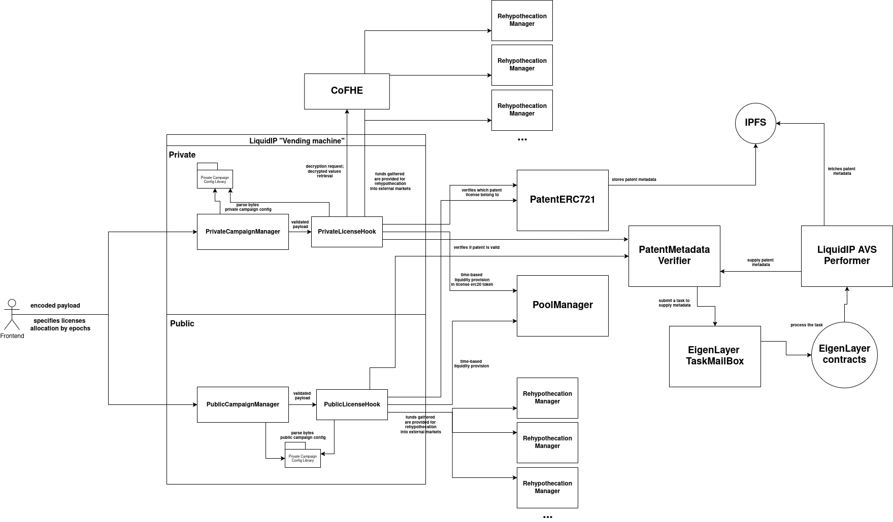
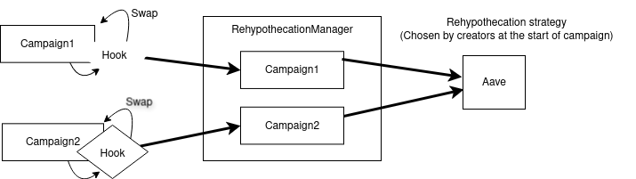

## Liquid-IP Monorepo

This repository contains smart contracts, a Next.js frontend (Scaffold-ETH 2), and a Go-based performer service to experiment with licensing, Uniswap v4 hooks, and off-chain metadata verification.



### Monorepo structure
- `packages/foundry`: Solidity contracts, tests, and deployment scripts
- `packages/nextjs`: Next.js app (Scaffold-ETH 2)
- `packages/performer`: Go performer service for off-chain processing


## Prerequisites
- Node.js >= 20.18
- Yarn (workspace) or Corepack
- Foundry (`forge`, `cast`)
- Anvil (ships with Foundry)
- A mainnet RPC URL for forking (Alchemy/Infura/etc.)


## Install
```bash
yarn install
```


## Running against a forked mainnet
1) Start a mainnet fork on port 8545
```bash
# Config contains valid mainnet RPC endpoint
yarn fork
```

2) Deploy contracts to the fork
```bash
# Uses packages/foundry/script/Deploy.s.sol
yarn deploy
```

Notes
- The deploy script mints USDC to the deployer on the fork via FFI using `cast` and configures a Uniswap v4 pool with the `PublicLicenseHook`.
- A minimal Task Mailbox mock is used locally so verifier tasks complete instantly with VALID status.
- Deployment addresses and ABIs are written to `packages/nextjs/contracts/deployedContracts.ts`.


## Running tests
All tests are Foundry tests under `packages/foundry/test`.

Types of tests
- Unit tests: configuration and hook internals
- Integration tests: end-to-end flows, e.g. Uniswap v4 plumbing and `SimpleV4Router`

Run tests
```bash
yarn test
```

## Frontend: test swaps with SimpleV4Router
1) Ensure the fork (31337) is running and contracts are deployed (`yarn deploy`).

2) Start the frontend
```bash
yarn start
```

3) Connect your wallet to `localhost:31337` and open the debug UI
```
http://localhost:3000/debug
```

4) Authenticate as the deployer in the UI (local dev only)
- Import this deployer private key into your wallet (e.g. MetaMask) while connected to the `localhost:31337` network:
```
0x879c8f8b406951ff3d1384017fe6080db719649d946597ef10c038734772c95b
```

5) Stake the Patent NFT into the Campaign Manager
- In the debug page, open `PatentERC721` and call:
  - `safeTransferFrom(<you>, <campaignManager>, 1)`
- This stakes tokenId `1` and enables the campaign pool logic.

6) Approve USDC for the `SimpleV4Router`
- In the debug page, select the USDC contract (from deployed contracts) and call `approve(router, amount)` from the deployer account.

7) Call `SimpleV4Router.swapExactInDefault(amountIn, amountOutMinimum)`
- The router is pre-configured in the deploy script with the default `PoolKey` for the campaign’s pool.
- Set `amountIn` in USDC base units (6 decimals) and a conservative `amountOutMinimum`.


<video controls width="800" muted>
  <source src="image/demo.mp4" type="video/mp4" />
</video>


## Rehypothecation Manager
The `RehypothecationManager` routes idle campaign proceeds into Aave v3 to earn yield during the campaign and returns principal plus accrued yield to the campaign owner after the campaign ends.

What it manages
- Per-pool, per-currency vaults keyed by Uniswap v4 `PoolId` and `Currency`
- aToken balances attributed to each active campaign
- Authorized hooks that are allowed to initialize and deposit on behalf of campaigns

Key functions
- `authorizeHook(address)` / `revokeHook(address)`: Owner-managed allowlist of hook contracts
- `initializeCampaign(PoolId, Currency, campaignOwner, campaignDuration)`: Creates an active vault; verifies Aave support
- `deposit(PoolId, Currency, amount)`: Supplies ERC20 or ETH proceeds to Aave; allocates aTokens to the campaign
- `withdrawCampaignFunds(PoolId, Currency)`: After end time, sends principal + yield to `campaignOwner` and closes the vault
- `getAccruedYield(PoolId, Currency)`: View function to estimate yield accumulated so far

Aave integration
- Resolves aToken via `IPoolDataProvider.getReserveTokensAddresses`
- Supplies ERC20 via `IPool.supply`
- For native ETH currency, uses Aave’s Wrapped Token Gateway for deposit/withdraw

Security/permissions
- Only authorized hooks can initialize and deposit (`onlyAuthorizedHook`)
- Only the designated `campaignOwner` can withdraw after the campaign ends

Configured endpoints (mainnet fork)
- Aave Pool, PoolDataProvider, and Wrapped Token Gateway are wired in the deploy script and can be adjusted in `packages/foundry/script/Deploy.s.sol`

How to observe in the UI
- Use the debug page to read vault state: call `getCampaignVault(poolId, currency)` and `getAccruedYield(poolId, currency)` on `RehypothecationManager`





## Performer service (Go)
The performer service handles off-chain processing (e.g., metadata retrieval/validation), and can be run locally for experimentation.

Location
- `packages/performer`

Run locally
```bash
cd packages/performer
go run ./cmd/performer
# or build
go build -o performer ./cmd/performer
./performer
```

Docker
```bash
cd packages/performer
docker build -t liquid-ip-performer .
docker run --rm -it liquid-ip-performer
```

Configuration
- Provide RPC, IPFS, and any credential/env settings as needed (see `packages/performer/README.md` or source). Adjust to your infra.


## Common troubleshooting
- USDC balance is zero after deploy on a fork
  - Ensure the fork runs at `http://127.0.0.1:8545` and FFI is allowed; the deploy script uses `cast` FFI to mint USDC from admin role on the fork.
- Frontend can’t find contracts
  - Re-run `yarn deploy` to refresh `deployedContracts.ts`. If needed, regenerate ABIs/addresses with `node packages/foundry/scripts-js/generateTsAbis.js`.
- Deployment script reverts trying to settle USDC balance
  - After running a fork wait for 3-5 minutes - after all data fetch script can be run successfully


## Development notes
- Contracts use Solidity 0.8.27. Uniswap v4 periphery components that require 0.8.26, handled via per-file pragmas and `deployCode()` cheatcode.
